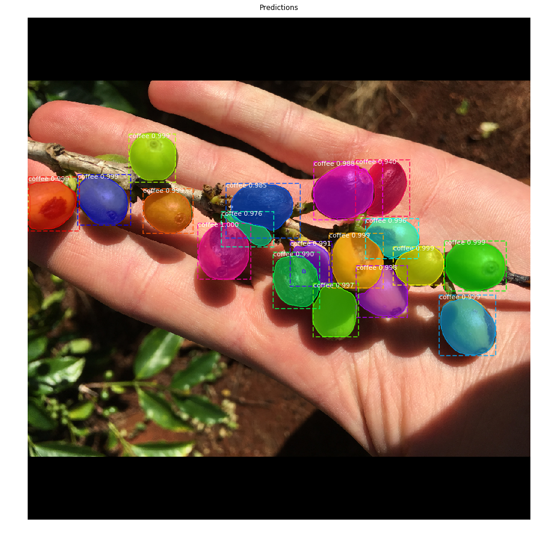
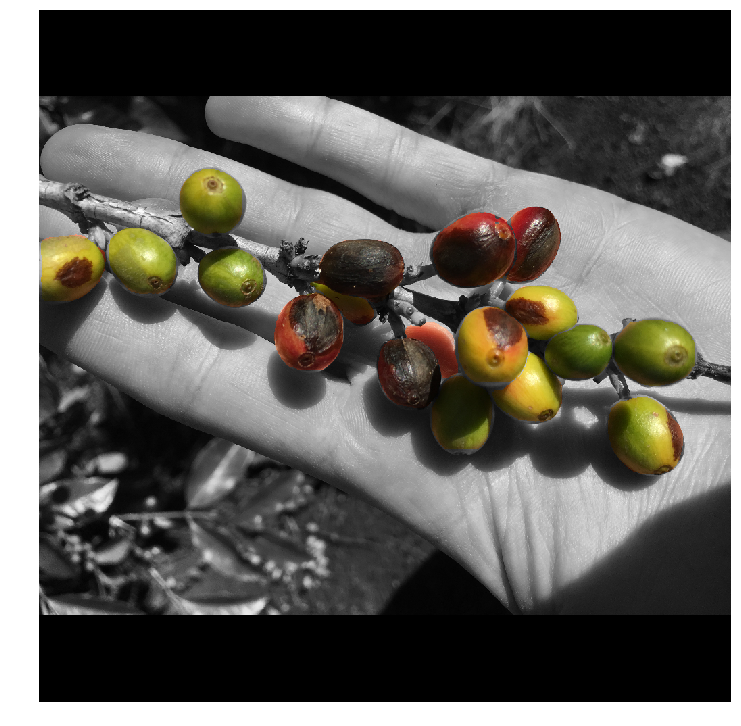

This was a project that I've been considerably interested in since I worked at Kauai Coffee during summer 2017. The problem seemed alluring; in the sense that (1) no one has quite approached the problem using machine learning and (2) this is a tangible problem that a large business has + one that *I could solve. Damn that sounds pretty opportunistic! :) 

### The Problem:
Timing the harvest season for a large coffee orchard is a difficult and specialized task. Without decades of experience, it would be costly to train anyone to oversea/replicate this.

### The Proposed Solution:
Train a supervised machine learning model to identify coffee cherries in a given image + determine its stage of ripeness. 

### Read More! 
Check out my blog post featured on <a href="https://towardsdatascience.com/using-deep-learning-to-estimate-coffee-harvest-yields-8edb1b94c698"><b>"Towards Data Science!"</b></a>

<figure class="half">
    
    
    <figcaption>Coffee detection and artistic visualization.</figcaption>
</figure>

