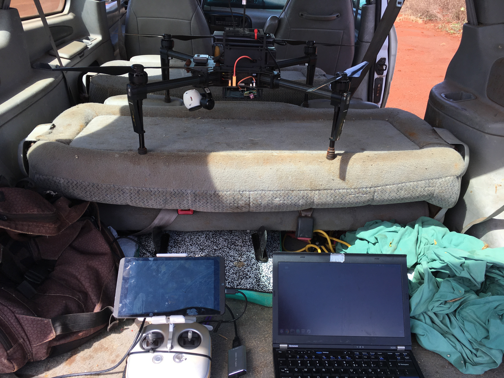
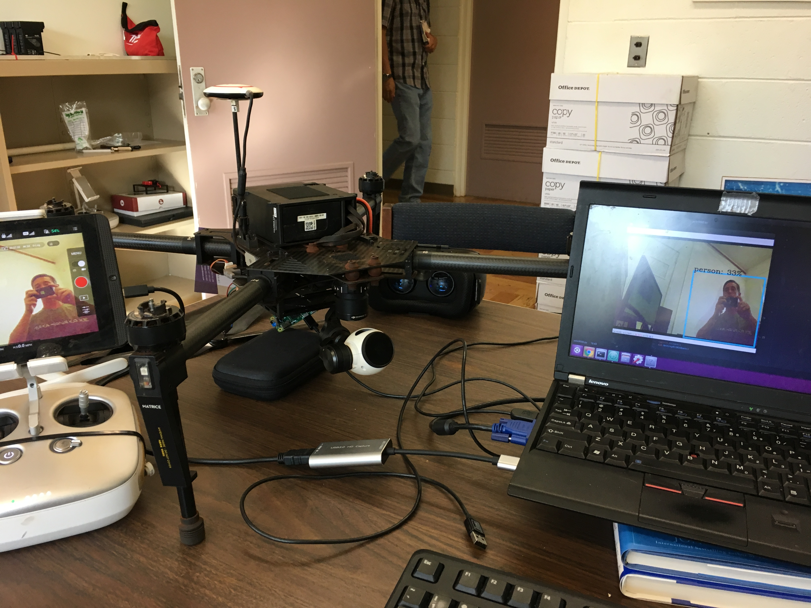

YOLO (You Only Look Once) is a powerful object detector that has come out in recent years. It would be really helpful to run on a drone for a lot of reasons that people are interested in: search and rescue, warehouse ops, robot helpers, etc. Also I wanted a chance to treat my thinkpad like a real field laptop. This is a simple way to do that using any DJI drone with a controller that outputs HDMI. 

<figure>
	
	<figcaption>High tech surf/ramble mini-van.</figcaption>
</figure>

### Hardware Needed:
- DJI Drone w/controller that outputs HDMI
- Mini HDMI to HDMI adapter
- HDMI USB capture device
- PC

I was relieved to find a <a href="https://www.amazon.com/Adapter-Capture-Monitor-Windows-System/dp/B07CZWP144/ref=olp_product_details?_encoding=UTF8&me=&th=1"><b>USB capture device with Linux support</b></a>, not many do.

### YOLO
With all the hardware the easy part is cloning a github repo and running the script. OpenCV is able to recognize the USB capture device as a webcam, so really any CV app that you could come up with could use this.

Get the script <a href="https://github.com/markjay4k/YOLO-series/blob/master/part4_video.py"><b>here</b></a>. (Disclaimer: I did not write this script)  
Go to settings in the DJI Go app and set the output to be shared with the HDMI port.

<figure>
	
	<figcaption>Real-time capable.</figcaption>
</figure>

DONE. 

