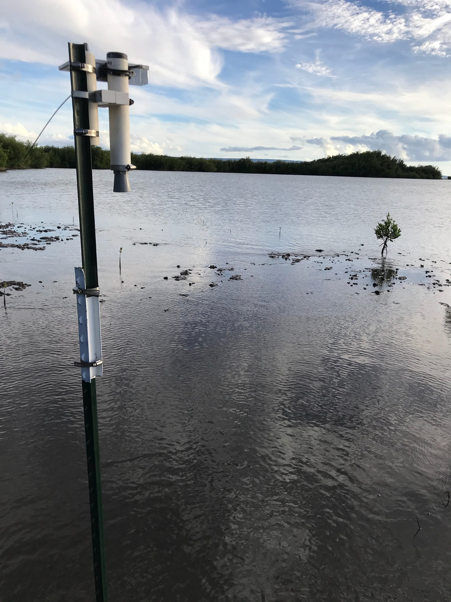
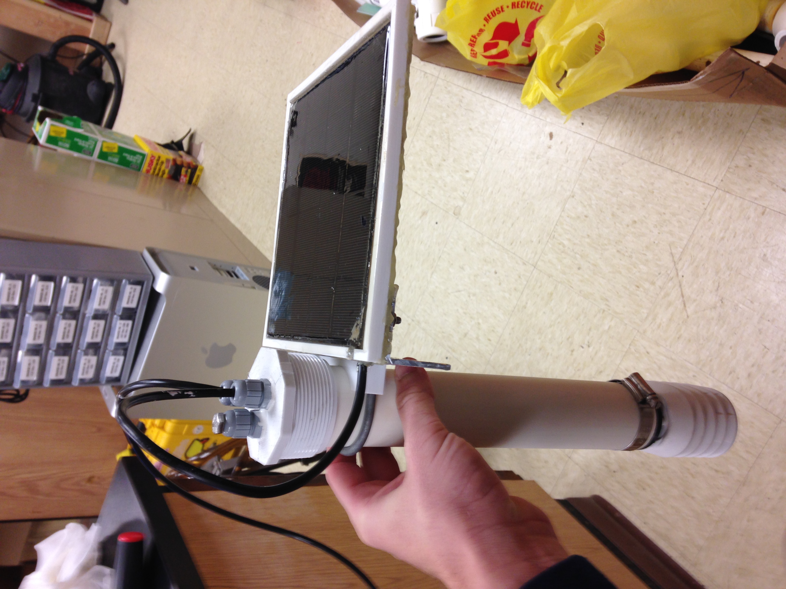
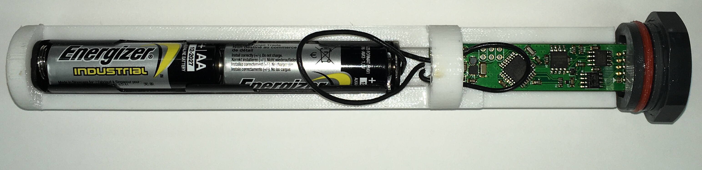

Check <a href="https://grogdata.soest.hawaii.edu/project_info/"><b> here</b></a> for more information on the project under Brian Glazer.

We work with fishponds around the state of Hawaii to better collect environmental data that assists in restoration and maintenance efforts of a communal food resource. The data is also streaming in real-time <a href="https://grogdata.soest.hawaii.edu/"><b> here.</b></a> The MESH Lab at the University of Hawaii at Manoa has been really good to me, I especially thank Brian for being patient with me as I break a lot of things... 

### My Role
What do I do besides break things? For the most part I help  with 3D modelling and fabrication of the housings/packages that hold the sensors we deploy. Below are a few examples of the ultrasonic tide sensors and radiation shields. It's fun to have the freedom to iterate/prototype as much as possible. Saying we 3D print often would be an understatement.

 
<figure class="half">
    
    
    <figcaption>Ultrasonic tide gauges.</figcaption>
</figure>

Here's one in action on Molokai! Live data for this node is <a href="https://grogdata.soest.hawaii.edu/molokai/nodepage/node-036/"><b> here.</b></a> 

<figure>
	
	<figcaption>Node-036 @ Ali`i Fishpond, Molokaʻi (21.073033, -156.981083)</figcaption>
</figure>

Radiation shield for temperature, humidity, and barometric pressure spun up in ~1 day with <a href="www.stanleylio.com"><b> Stanley.</b></a> : 

<figure>
	
	<figcaption>Radiation shield.</figcaption>
</figure>

Check out my dedicated page for our <a href=2018-08-04-stream-loggers.md><b>stream logging project</b></a> in the Alawai Watershed.
<figure>
	
	<figcaption>Stream logger (Stanley Lio built the really nice custom electronics!)</figcaption>
</figure>

### Side Projects 
Aside from the trad mechanical engineering aspect, I had the chance to do some of the other engineering that I enjoy. Below is an experiment I ran to assess the impact of air column tempurature on our ultrasonic tide sensors. The ultrasonic sensors take internal temperature measurements to compenstate for the speed of sound in different air temperatures. However the sensor is usually in the sun (hot) even though the air temperature might be cool. So, I placed a sensor on the roof to measure this change throughout the course of a day. Also included were a couple of temperature sensors to compare the sensor body temperature vs actual air temperature. Check back soon for a dedicated page :) 

<figure>
	
	<figcaption>Air column experimental setup on the roof.</figcaption>
</figure>

Got questions? Reach out! jamesthesken@gmail.com

s
