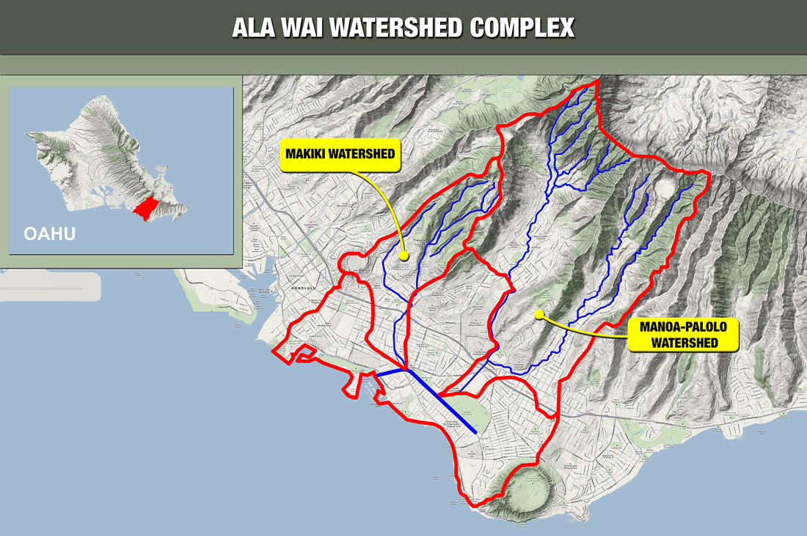
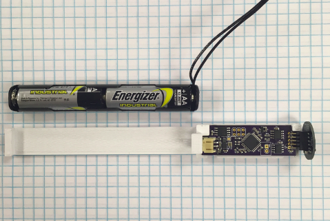
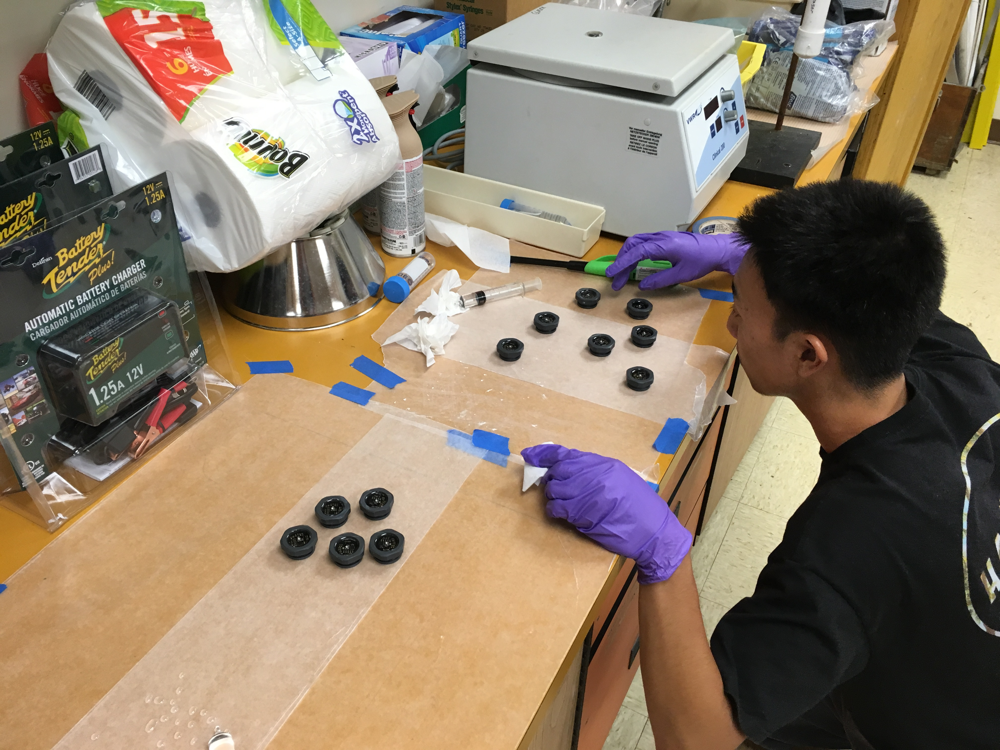
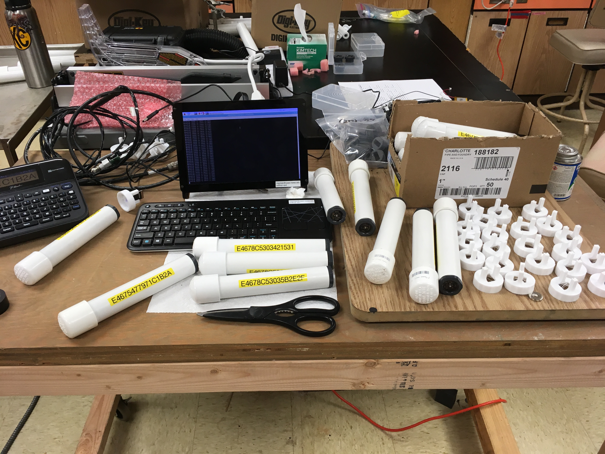
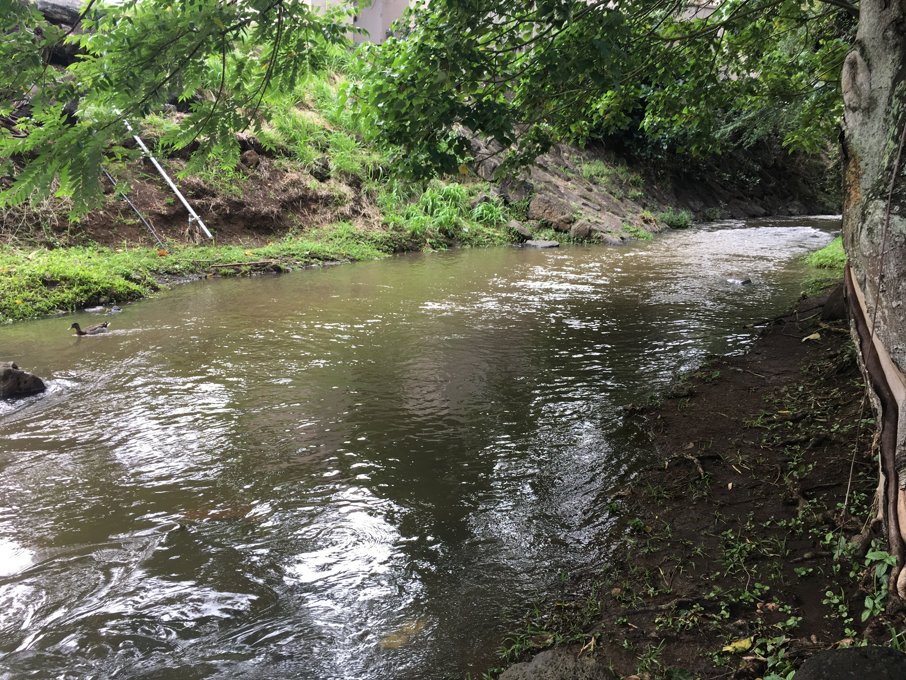
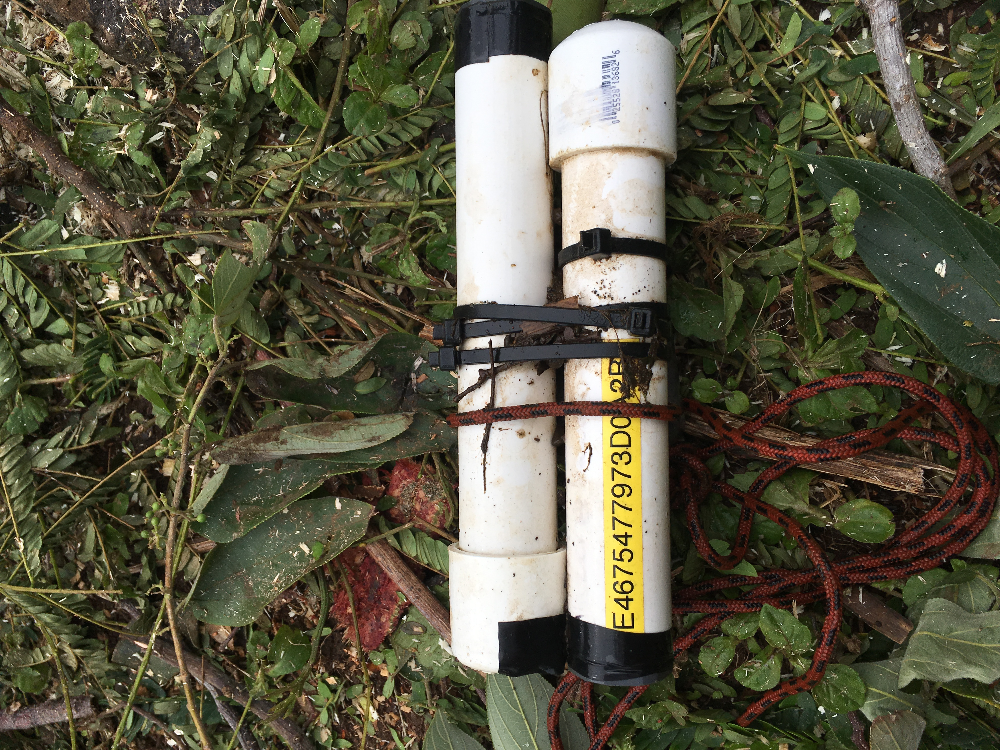
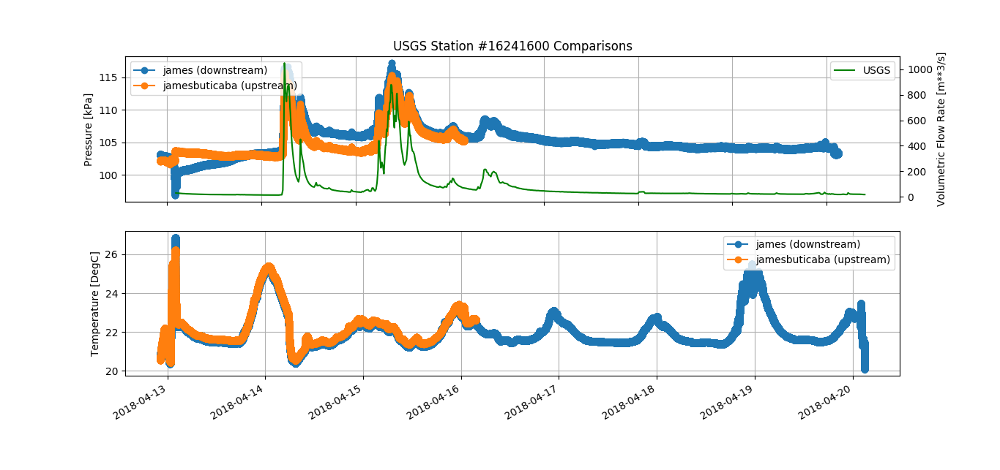

The lab/project/more info: <a href=https://grogdata.soest.hawaii.edu/project_info/ ><b>Project OTIS @ University of Hawaii at Manoa</b></a>

PI: Brian Glazer

The SMART Alawai website will be available soon for full project details. Let this page be a small overview of my perspective on the engineering side.

We had a ~4 month timeframe for the development of a deployable data-logger to record pressure, temperature, and light in the Alawai watershed. The sensors were then distrubuted during our workshop for middle school teachers who teach in schools within the watershed. Here's a map for context:

<figure>
    
    <figcaption>Outline of the Alawai Watershed</figcaption>
</figure>

## The Design

Waterproof devices are unsurprisingly difficult to manufacture. Especially if the electronic components inside are to be removable for debugging or battery replacements throughout the deployment period. Here's the final iteration we came upon before distribution at our workshop. Prior models were difficult to take apart (taking a saw and destroying its PVC enclosure). Mario Williamson, who is the master machinist at SOEST made/manufactured the beautiful removable endcaps:

<figure>
    
    <figcaption>Final workshop iteration.</figcaption>
</figure>

The chassis design was the result of a constant feedback loop between Stanley, Brian, Kasey, and myself. The tight constraints of the enclosure required a closeness of electronic and housing design decisions. This was a great experience in interdisciplinary design. Here are two of the first iterations:

<figure class="half">
    
    
    <figcaption>Early design iterations.</figcaption>
</figure>

## Assembly Line
We had to manufacture and assemble ~30 units. This was also an interesting experience! This took ~1-2 weeks between Kasey and I to complete.

<figure class="half">
    
    
    <figcaption>Kasey "Resin Sensei" Sugano // My device testing setup.</figcaption>
</figure>

## Example Data
To understand the user interface and process of receiving data, the engineers should field-test the equipment they make. The biggest learning curve our users had was using a command line interface, but going out in the field can be tough sometimes too. During the heavy rains of April that we got in Hawaii I deployed a couple of the loggers in the Manoa stream near a USGS station for comparison. 

<figure class="half">
    
    	
    <figcaption>Deployment location & recovery.</figcaption>
</figure>

It was almost a guarantee that I had lost those sensors in the flash flood. I almost owed Brian a beer. Thankfully I was able to recover the sensors that got lodged under the debris! Was also able to get data for the flash flood.

<figure>
    
    <figcaption>Pressure & temperature log (April 13, 2018 - April 20, 2018).</figcaption>
</figure>

