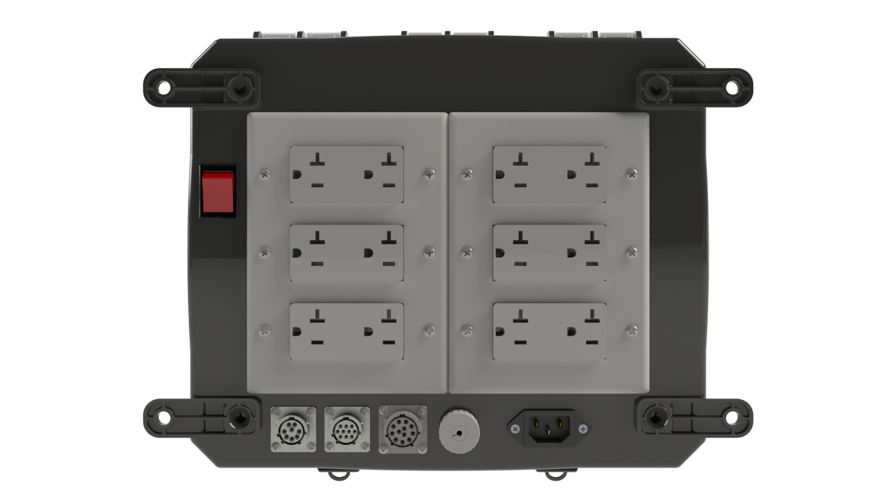
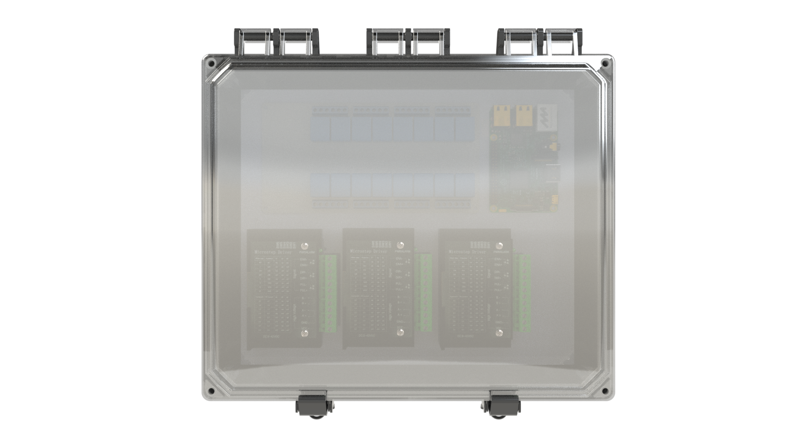
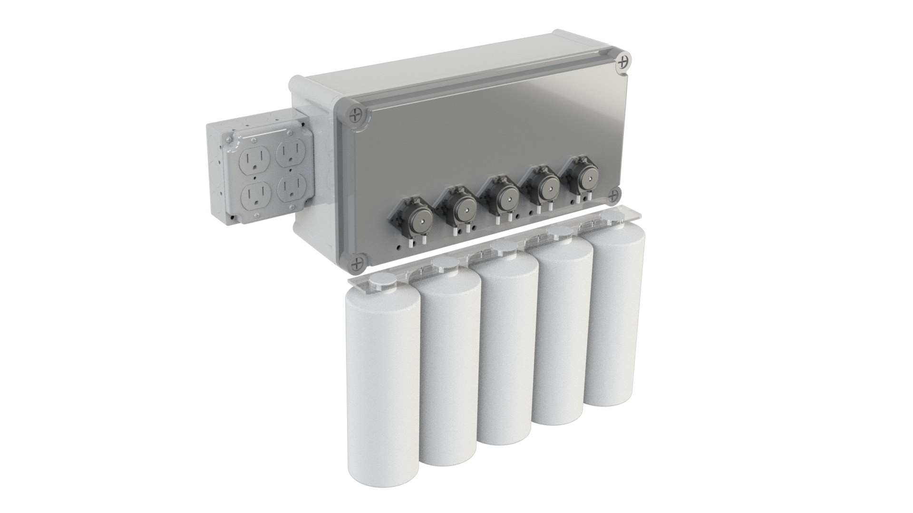
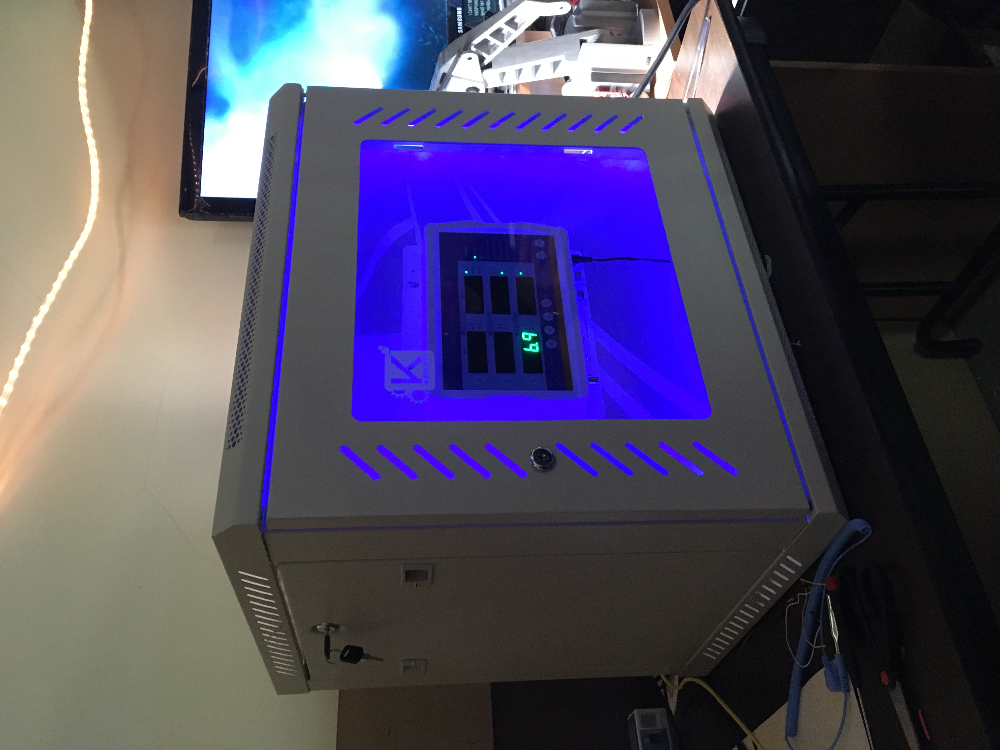
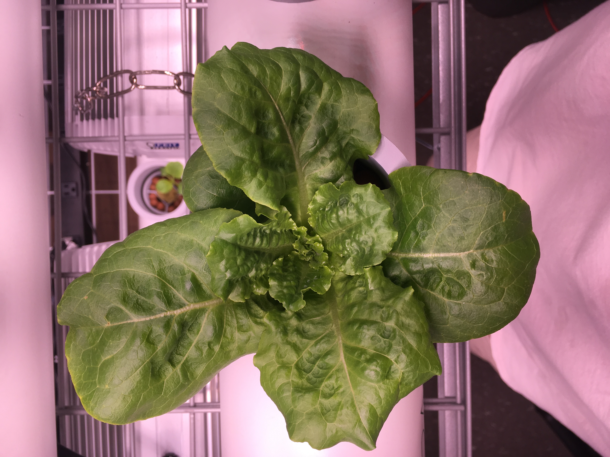

This past year I have been working on an automated hydroponics project called <a href="https://www.box-farm.com/"><b> Box Farm.</b></a> One of the things that frustrated me the most, was a lack of an open-source project for hydroponic controls.

### Towards Open Source	
It would be great to have a standardized hydroponic controller that could be easily assembled using off-the-shelf components with good documentation or bought as its own kit. Here are a couple of the designs I came up with to suit that need: 
 
<figure class="half">
    
    
    <figcaption>The Box.</figcaption>
</figure>

The features would include:

* 6 Controllable outlets
* Sensor ports for temperature, EC, and pH
* Wireless monitoring via Raspberry Pi
* Ethernet inlet
* Power switch and IEC plug. 
* Accessible front panel. 

The same box could expand into a unit with peristaltic pumps autonomously controlled as well. The first design I came up with had that in mind:
<figure>
	
	<figcaption>The Box, with peri pumps attached.</figcaption>
</figure>

If enough interest is there, I will put together the prototype. Until then:

As I continue to develop the box, I bought a Blue Lab Pro Controller and mounted it inside of a server box I bought on <a href="https://www.amazon.com/gp/product/B079P5Q5J4/ref=ppx_yo_dt_b_asin_title_o05_s02?ie=UTF8&psc=1"><b> Amazon.</b></a> I also put controllable LED's to make it look like a true grow setup ;)

<figure>
	
	<figcaption>Installed Blue Labs with LEDs.</figcaption>
</figure>

So far the growing has been great!

<figure>
	
	<figcaption>Batch of lettuce on the way.</figcaption>
</figure>

Want to know more? Interested in working together? Contact me at jamesthesken@gmail.com

