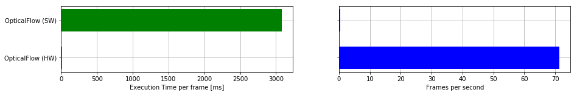

I was fortunate enough after graduation to have an internship with General Dynamics Mission Systems on Kauai doing R&D. Even more so to have been evaluating computer vision programs on the cutting edge of computing. Heterogenous computing systems are becoming a vision for the future as <a href="https://www.youtube.com/watch?v=uqWFHDnau1U&list=PL6wMum5UsYvZnMYs3C4ai-iqoC0sv03BV&index=4"><b>Moore's Law is seeing an end.</b></a> 

I worked closely with the <a href="https://www.xilinx.com/products/boards-and-kits/zcu104.html#documentation"><b>Xilinx ZCU104</b></a> and <a href="https://store.digilentinc.com/pynq-z1-python-productivity-for-zynq-7000-arm-fpga-soc/"><b>PYNQ-Z1</b></a> evaluation boards and learned a lot about the new framework being developed by Xilinx to bridge the gap between high and low level programming. One of the biggest ideas being reconfigurability and reuasability - something that has yet to be seen in the world of FPGA's.

Some of the work I did can be found on my <a href="https://github.com/jamesthesken/xilinx-zcu104-demos"><b>Github.</b></a>

One of the most interesting examples of hardware acceleration was in running optical flow, which is normally used as a tracking mechanism in computer vision. Running on the general purpose ARM processor saw less than a frame per second. Using the hardware overlay resulted in ~60+ FPS. A 60x increase in processing power. 

<figure>
    
    <figcaption>Hardware acceleration comparison for optical flow.</figcaption>
</figure>

I created a demonstration to track moving pedestrians on a busy sidewalk, which would have run real-time, however there are still some issues Xilinx will need to work out.
* Loading multiple hardware accelerated overlays (eg. optical flow and 2D filtering simultaneously.) The memory management class (xlnk) couldn't be loaded twice.
* HDMI I/O for the ZCU104 when using the PYNQ-ComputerVision library.

<figure>
    
    <figcaption>Detected pedestrians on a busy sidewalk.</figcaption>
</figure>

Once that is fixed everything should work great.

* <a href="https://www.youtube.com/watch?v=9CxeCY5PPyA&t=30s"><b>Demo video of 2D filters.</b></a>

* <a href="https://www.youtube.com/watch?v=Xt-k3ONAua8"><b>Tracking demonstration.</b></a>

