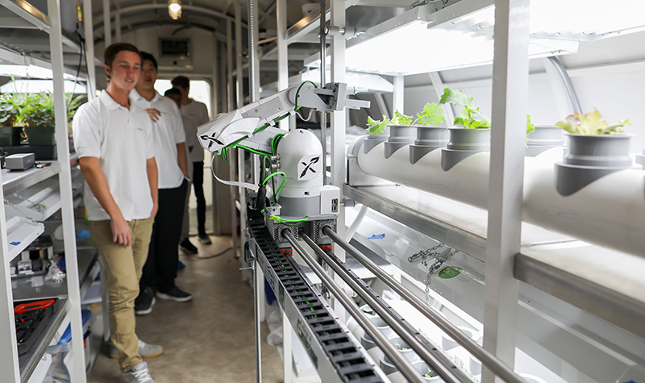
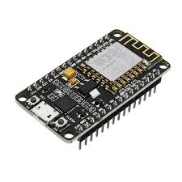
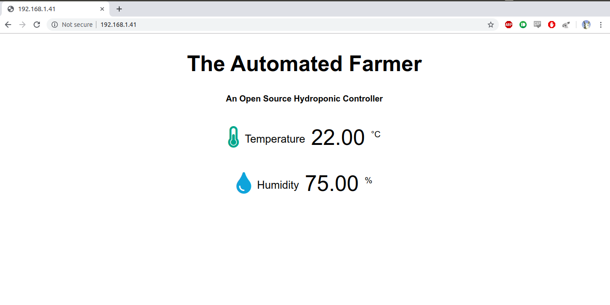

## My Hydroponic Journey

I spent about a year working day and night on an automated robotic hydroponic garden for my senior design class called Box Farm. After graduating I got to go on a trip to the University of North Dakota to install the Box Farm in a NASA Inflatable Lunar Mars Habitat. I also got to live in the habitat for 4 days with my friends. 

<figure>
	
	<figcaption>The Box Farm installed in a NASA habitat.</figcaption>
</figure>

We had quite a bit of press-coverage <a href="https://www.hawaii.edu/news/2019/05/12/space-plants-could-be-astronaut-game-changer/">throughout</a><a href="https://bigislandnow.com/2019/05/12/uh-manoa-develop-space-travel-tool/"> Hawaii</a> which was exciting!

Although I'm no longer working with the team, my interest in hydroponics has yet to cease. One of the most frustrating parts during the design phase of Box Farm was the lack of an expandable hydroponic controller! Blue Lab controllers and others are nice but they tend to be closed source and difficult to integrate for such a custom project.

I want to change that for others. To create an off-the-shelf hydroponic monitoring/control solution that is modular in design, able to adapt for projects like Box Farm.

## $5 Wi-Fi-enabled microcontrollers? Let me see!

After discovering the NodeMCU, I knew my hydroponic controls career would change forever. While this isn't a commercial for them, it's certainly a reason why I think you'll want to stick around for the development of this hydro-controller.

<figure>
	
	<figcaption>A NodeMCU micro-controller.</figcaption>
</figure>

If you're familiar with Arduino controllers, great. It's just like an Arduino Nano with integrated Wi-Fi. If not that's okay too! Follow along and as always, feel free to email me with any questions you have.

We are going to be using this for the development of the first step in our automated hydroponic journey.

## Creating a Web Interface

What's a modern hydroponic controller without a web application? Below is a screenshot of our *first* draft of our user interface:

<figure>
	
	<figcaption>Prototype web-app</figcaption>
</figure>

We can serve any static web-app we want through the NodeMCU but for now, but for now we keep things simple. 

